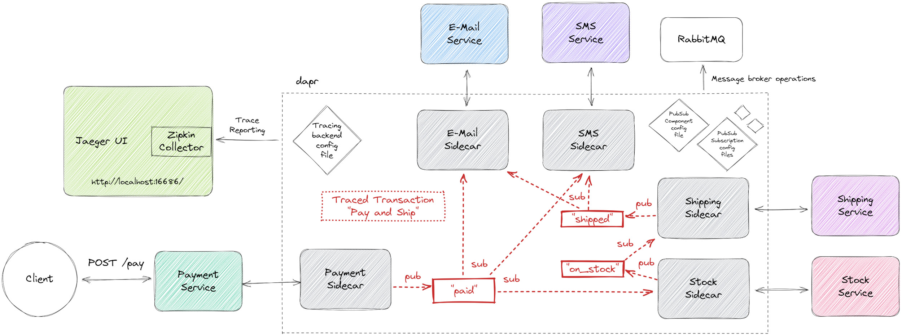

# dapr example - distributed tracing (pub/sub)

<a href="https://www.dapr.io/"></a>

The following scenario is implemented here.



## Tracing the Transaction "Pay and Ship"

A client pays an order. Then the payment service publishes a message on the
_"paid"_ topic to inform other services. E-Mail, SMS and the Stock Service
are subscribers of this topic. Thus, the customer gets notified about
the payment via E-Mail and SMS. The Stock service checks whether the item is on stock
(it is in our case) and publishes a message on the _"on_stock"_ topic.
The Shipping service is the single subscriber of that topic.
It arranges the shipment and when the item is shipped,
it publishes a message on the _"shipped"_ topic.
Both, E-Mail service and SMS service are subscribers of that topic
and again inform the customer about the shipment.

We are tracing this Pub/Sub based transaction.
As the trace starts at the Payment service, 
the dapr sidecar of it creates the _Trace ID_ and appends
it as request header (called `traceparent`) to the published message.
All intermediate services (Stock and Shipping) have to manually forward 
this header when they publish their messages.
This is [propagating sequential service calls](https://docs.dapr.io/developing-applications/building-blocks/observability/tracing-overview/#propagating-sequential-service-calls).
In contrast, both, the E-Mail service and SMS service are only subscribers forming ends of the trace. 
Therefore, they do not need to care about any further tracing actions.

All tracing operations like creation and reporting to Jaeger via Zipkin collector are done by _dapr_,
which is explicitly configured to do distributed tracing using the `tracing-config.yaml`.


## Prerequisites

- [dapr CLI](https://docs.dapr.io/getting-started/install-dapr-cli/)
- Java (Version >=17)
- A running [RabbitMQ](https://www.rabbitmq.com/) instance
  ```shell
  docker run --rm -it -p 15672:15672 -p 5672:5672 rabbitmq:3
  ```
- A running [Jaeger](https://www.jaegertracing.io/) instance
  ```shell
  docker run \
  -e COLLECTOR_ZIPKIN_HOST_PORT=:9412 \
  -p 16686:16686 \
  -p 9412:9412 \
  jaegertracing/all-in-one
  ```


## Get started

### 1. Build all services

```shell
./gradlew buildAllServices
```

### 2. Run each service alongside a dapr sidecar

```shell
dapr run --app-id payment-service --app-port 8080 --app-protocol http --dapr-http-port 3500 --components-path components/local --config tracing-config.yaml -- java -cp payment/build/libs/fat.jar com.example.PaymentKt
dapr run --app-id email-service --app-port 8081 --app-protocol http --dapr-http-port 3501 --components-path components/local --config tracing-config.yaml -- java -cp email/build/libs/fat.jar com.example.EmailKt
dapr run --app-id sms-service --app-port 8082 --app-protocol http --dapr-http-port 3502 --components-path components/local --config tracing-config.yaml -- java -cp sms/build/libs/fat.jar com.example.SmsKt
dapr run --app-id shipping-service --app-port 8083 --app-protocol http --dapr-http-port 3503 --components-path components/local --config tracing-config.yaml -- java -cp shipping/build/libs/fat.jar com.example.ShippingKt
dapr run --app-id stock-service --app-port 8084 --app-protocol http --dapr-http-port 3504 --components-path components/local --config tracing-config.yaml -- java -cp stock/build/libs/fat.jar com.example.StockKt
```

As you can see, the dapr CLI is used to start up both, the dapr sidecar and the service.


### 3. Be the client - pay the bill
```shell
curl -X POST http://localhost:8080/pay
```


### 4. View the traces in Jaeger UI
Visit http://localhost:16686/

# References
- [dapr concepts](https://docs.dapr.io/concepts/)
- [dapr service invocation explained](https://docs.dapr.io/developing-applications/building-blocks/service-invocation/service-invocation-overview/)
- [dapr distributed tracing](https://docs.dapr.io/developing-applications/building-blocks/observability/tracing-overview/)
- [dapr distributed tracing with jaeger](https://docs.dapr.io/operations/monitoring/tracing/jaeger/)
- [Jaeger Tracing](https://www.jaegertracing.io/)
- [dapr publish and subscribe](https://docs.dapr.io/developing-applications/building-blocks/pubsub/)
- [dapr how to: publish a message and subscribe to a topic](https://docs.dapr.io/developing-applications/building-blocks/pubsub/howto-publish-subscribe/)
